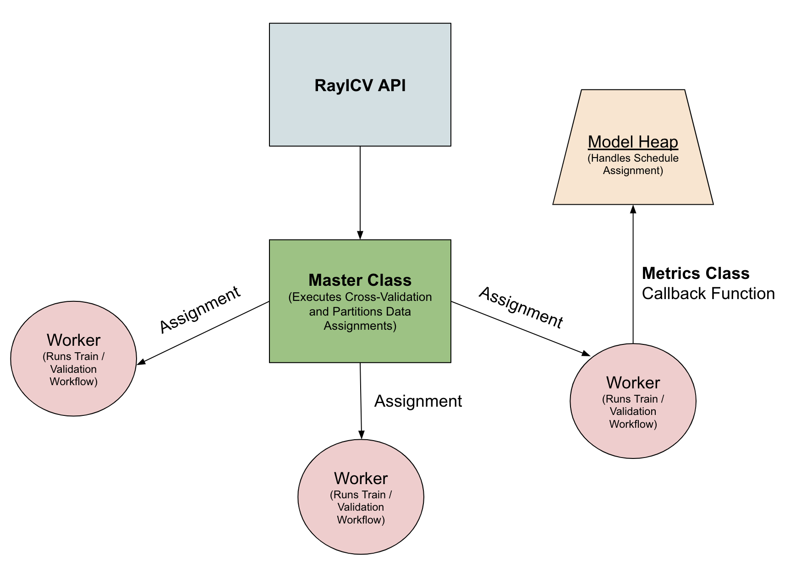

# RayICV 
## (Ray ML Internal Cross-Validation Solution)

RayICV Implements a hyper-parameter tuning solution with cross-validation built-in on top of the Ray train framework in order to emulate the scheduling of jobs based on folds trained and model configuration. 

## Design Overview

RayICV implements its own job scheduling for eahc train job by splitting workflows based on the ids of the workers generated through the Ray Train interface. It can then split each workers job through the Min-Heap Scheduling algorithm that priotizes training of folds with models that have a better performance statistic. 





### API Shim

```python

RayCrossValidation:
    def __init__(
        self,
        model,
        dataset,
        parameters,
        folds,
        optimizer,
        epochs=10,
        batch_size=32,
        use_gpu=False,
        backend="torch",
        num_workers=3,
    )
```

The API shim layer takes in the normal Ray train distributed environment parameters alongside the number of folds and batches that the user wants the cross-validation to perform. 

### Master Class

The master class implements the assignment of workers to configurations and uses the `CrossValidationFoldGenerator` in order to partition the models such that each configuration is trained for the number of folds specified by the user.

### Worker Class

The worker class takes the model object and the assigned configuration and runs a "workflow" for either training or validation and then reports back the metrics of loss through the `Metric` class which implements customs callbacks. 

### ModelHeap

The model heap object class is how the RayICV prioritizes the next job to run based on the results given from the workflow in the callback reported by the metrics class. 


--------------------

## Environment Setup

To install the virtual environment, run the following commands from the project's root directory:
```bash
conda env create -f environment.yml
conda activate iolaus-dev
conda env list
```

If this is your first time running Iolaus, you may encounter this error:
```
Traceback (most recent call last):
  File "/Users/Jeremy/Desktop/iolaus/src/user_api_test.py", line 44, in <module>
    train_data = datasets.MNIST(
  File "/Users/Jeremy/opt/anaconda3/envs/iolaus-dev/lib/python3.10/site-packages/torchvision/datasets/mnist.py", line 102, in __init__
    raise RuntimeError("Dataset not found. You can use download=True to download it")
```

In that case, follow the instructions to modify the Torchvision source and rerun. If all goes well, then the MNIST dataset should download locally.
